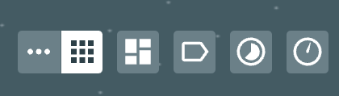
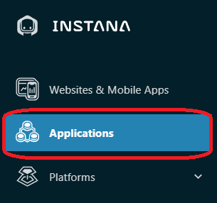
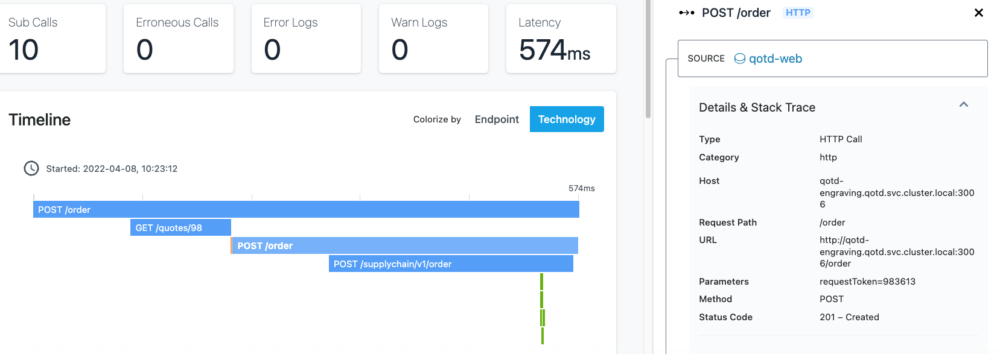
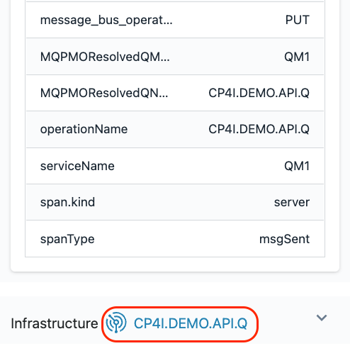

***

In this portion of the lab, you will explore some key Instana capabilities including monitoring of Kubernetes, monitoring of applications, and monitoring of infrastructure.

## 1-1: Explore Kubernetes

Open the browser and log into the Instana user interface. Chrome, Firefox, Edge, and Internet Explorer are all supported.

On the left navigation, select **"Platforms"** and then **"kubernetes"**. Notice that you have the option of selecting other infrastructure providers such as VMware, Power HMC, and zHMC

  

You will see a list of kubernetes clusters. Select the **demo-us-cluster** to drill in for more details.

  

Select some of the other tabs to explore the kubernetes monitoring. We recommend you look at the **Events**, **Nodes**, and **Pods** tabs.

When you select the **pods** tab, you will see a list of all pods running within the cluster.  Notice that you can see pod log
entries collected in context with kubernetes metrics.  If you click on the **analyze** icon, you can drill into the pod log messages.

Click on one of the links on the left side and drill into the pod utilization details.

***

## 1-2: Explore the Infrastructure View

Next, explore the Infrastructure view.  To do this, click on the **"Infrastructure"** icon on the left side.

  

You will see if fiew showing all of the servers that make up the environment.  Each of the towers represents a server or some device/appliance that is being monitored remotely.

  

Look for the zone labeled **IBM Middleware**.  This zone contains two servers.  One is a DataPower appliance and the other is a Linux server that is running **IBM ACE** and **IBM MQ**.

If you want to search for something like a host, middleware, or zone, you can use the Lucene query language in the search bar.
- Click in the filter bar and select **"Entity"**
- A list will popup. Find and select **"Host"**
- Once you have select "Host", another list will popup. Select "name"
- Now, you will see **"entity.host.name:"**.  After the ":", you can do a wildcard search.  For example **"entity.host.name:vader-acemq*"**.  This will allow you
to search for the server with hostname vader-acemq.  If the server does not show up, make sure you have an **asterisk (*)** at the end of the hostname.

  

Once you have found the host, flyover the tower that represents the vader-acemq node.  
You need to flyover one of the **corners** of the tower.

   

You'll notice that a number of components were automatically discovered and are instrumented for monitoring.
This is the ACE and MQ server. You can see the MQ and ACE components along with 2 discovered JVMs, and processes.

Remove the filter at the top of the page by clicking on one of the two X's:

   

In the bottom right corner there are several icons that allow you to organize the Infrastructure view in different ways.  For example, group the servers by OS architecture.

  

We recommend you explore those at the end of the lab if time permits.

Next, click on the **"Comparison Table"** near the top of the page.

  

This table shows a sortable and searchable list of the Hosts that make up this environment.  You can quickly find hosts consuming high CPU, high memory, or have poor health.

In addition, if you select where is says **"Hosts"**, there is a dropdown list that allows you to see lists of JVMs, containers, etc.

  

Change from **"Hosts"** to **"Docker Containers"** in the dropdown list and you'll see a complete list of containers and their utilization and health.

Switch back to the Map view by clicking on **"Map"** near the upper left corner.

  

Zoom in with the plus sign in the bottom right corner.

  

You'll notice that each tower is actually comprised of multiple pizza boxes.   Each one represents an **"Entity"** such as an MQ Queue Manager or an ACE Integration Node.

  

Flyover the ACE/MQ server again until you see a list of all discovered Entities.  If you only see 1 entity, move your mouse to one of the corners of the tower.
Once you see all of the entities, click your mouse.  You'll see a dialog open

  

Use the scroll bar to scroll down. You'll notice that you see each of the types of Entities that were discovered.  Expand the MQ entity type and you'll see the Queue
Manager that was discovered.

  

It is possible to click on either the **Open Dashboard** button or the links for the individual entities such as IBM MQ Queue Manager or JVMs.  If you clicked, it would navigate to either the Host 
operating system metrics or the specific middleware entity.

Click on the **Open Dashboard** button and we'll examine the Host Agent dashboard.  After you click on the button you'll see a screen that looks like this:

  

You can see fine grained metric data for the Host operating system. Scroll down and explore the other metrics.

In the upper right corner, select the **time selector** widget and change the time interval to **Last minute**.
You'll be able to see granular metrics at 1 second granularity in the UI. This  is one of the key strengths of Instana.

  

In the upper right corner, click on the **Live** button to switch to a live view.  You will see data streaming into the system in near-realtime.

  

Switch back to a 1 hour view using the same button in the upper right corner.
  

As you scroll down the page, you'll notice a section on the left side of the screen that contains a list of Entity types that were discovered. This is the same list that you 
saw earlier on the Infrastructure view.

  

Expand the IBM MQ Queue Manager section and select the link for the **"QM1@vader-acemq.coc-ibm.com** queue manager

You will navigate to the dashboard for the MQ Queue Manager. Scroll down the page and examine the metrics.  There are many tables that contain links that would allow you to
drill into the listener, topics, queues, channels, and more.  Let's focus on the Channels.  Scroll down to the table labeled **"Channels"**.  Select the link next to the one with connection name 10.0.0.3.
  

Examine the Channel metrics on the page.

Next, look at the top of the screen.  You'll notice that this is a breadcrumb that allows you to navigate back to where you were earlier in your nativations.   It is also
possible to use the back button in your browser.
  

If time permits at the end of the lab, you can explore some of the other elements within the MQ sensor or other middleware such as ACE.

***

### 1-3: Explore an Application

Use the left side navigation to select **Applications**

  

Then, select the **Quote of the Day** application.

  

On this page you can see the transaction volumes, the number of erroneous calls, latency, and the top services that make up the application.  These are the **golden signals**.

You'll notice a number of tabs across the top of the screen.  Explore these tabs.  In particular, let's take a look at the **"Dependencies"** tab.
  

On the dependencies tab, you'll see a full topology of the application services.  This topology is discovered automatically.  You can see transactions flowing between
the different nodes in the topology.   Most of these services are node.js based cloud-native services. The **"vader-acemq.coc-ibm.com-BK1:EG2"** is the ACE 
integration node named BK1 and Integration Server named EG2.   The QM1 node in the topology is the MQ Queue Manager named **"QM1@vader-acemq.coc-ibm.com"**.

Click on the **"QM1@vader-acemq.coc-ibm.com"** node.  Notice that there are 3 options that would allow you to navigate to the MQ dashboard, the transaction Flow within MQ, or analyze the transaction
calls through MQ.

Click on **"Upstream/Downsteam"** near the top of the page.  This will allow you to see a list of Upstream and Downstream services for the application.
  

Click on **"Stack"** where you can view the Application, Kubernetes, and Infrastructure stack that makes up the application.
  

All of this contextual and relationship data helps you analyze and debug you applications to get to root cause as quickly as possible.  In addition, our 
analytics uses this data to automatically group multiple related **"Events"** into a single **"Incident"** for diagnosis.

Close the **Stack** dialog by either clicking on the **Stack** button or somewhere else on the background of the Instana GUI.

Click on the Services Tab
  

You will see a list of services that make up the application.

Scroll down on the page until you see the **"qotd-engraving"** service.

Click on the **qotd-engraving** link on the left Column.  The qotd-engraving service is the service that calls an ACE flow and then puts a message on the MQ queue. 
We want to explore this service in more detail.
  

Click on the **"Analyze Calls"** button to analyze the individual transactions that are executing within the **"qotd-engraving"** service.
  

This will take you to a screen showing all of the different types of calls taking place within the qotd-engraving service.  At the top, there is a summary of all calls in terms of
transaction rates, return codes, erroneous calls, and latency.

On the right side, click the arrow to expand the list of qotd-engraving **"POST /order"** calls.  Instana is capturing 100% of the transactions so that you don't miss intermittent problems that might be occurring in the environment.  
  

Select one of the requests

You are now looking at the tracing data for a single transaction.  At the top of the screen, you will see a summary of the latency, sub-calls and timeline. On the right
side of the screen, you'll see the details and stack trace.
  

Scroll down and you will see the service endpoint list
  

Finally, scroll to the bottom of the screen and you will see a detailed call stack.  The call stack gives you the timing and sequence of the call going through the application.
  

If you select the text on the left or the timeline bar, the **"Details & Stack Trace"** context will change.

Explore the different types of calls going through this transaction by selecting the individual call.  When you select an entry, examine the detailed information on the right.
  

You should notice that different request types are color coded differently.  Blue represents the HTTP requests going through an App Server or java process. Orange represents
a database call.  And green represents a messaging call (ACE and MQ).  

When you select the Node.js App Server requests, you'll see the **StackTrace** on the right 
hand side. Within the **StackTrace**, click one of the URLs.

  

When you click on the link, Instana will decompile the code and show you the lines of code.  The exact line of code that is executing will be highlighted in yellow.
  

When you select the ACE portions of the call Stack (gen.supplychain, msgFlowTransaction, and postOrder) you will see key information including the flow name, Integration Node,
Integration Server, IP address, and more.

  

When you select the MQ portion of the call stack, you'll see key information related to the MQ environment on the right.  The information includes the Queue Manager, Queue Name,
and the message ID that was posted on the queue.
  

Scroll down to the very bottom where you see a link named **"CP4I.DEMO.API.Q"**. 

Click on the **"CP4I.DEMO.API.Q"** link and you will navigate to the Queue page of the MQ sensor for the CP4I.DEMO.API.Q queue.

Earlier, you explored the Queue Manager and the MQ Channels.  You're now looking at the queue that is being used by this application.  You'll notice key information
like the oldest message on the queue, queue depth, input/output rates, and more.
  

That completes this section of the lab.

***

## 1-4: Unbounded Analytics
Instana stores data data in datastores like Cassandra, Elasticsearch, and Clickhouse in such a way that it easy to apply **unbounded analytics** to the data and search for key patterns and characteristics.   Let's explore how you can use **unbounded analytics**

On the left side, select **Analytics**

  

At the top of the screen, you'll see that there is a dropdown called **Applications -> Calls**.  If you select the dropdown, you'll notice that there are several options available to analyze Application **Calls**, **Traces**, **Websites**, **Mobile Apps**, **Infrastructure** metrics, and **Profiles**.  For this lab, we'll focus on the default selection of **Application Calls**.  In your spare time, feel free to Analyze other types of data.

  

By default, you will see a list of **all** application calls.   **Unbounded analytics** provides and opportunity 
to answer some questions that you might have able the application calls.   Let's look at a scenario that a DBA might be interested in.   A DBA might want to see which SQL queries are taking the longest to run.  This is easy to achieve with **unbounded analytics**.

First, we need to filter the queries to just the database calls.  For this exercise, we'll select all 
database calls, but we could easily filter further to specific types of databases or specific applications.  
On the left side of the screen, select **Types** and then select the **Database** checkbox.  This will filter 
the calls to just the **Database** calls.

   

Next, click on the **Add group** button near the top of the page.

   

A drop down list will open with a list of the types of calls.  In the search bar, type **"statement"**
and then select **Database -> Statement**.

   

This will group all of the statements to the unique SQL statements that have been executed within the last hour.  
By default, these are sorted based on the number of calls.

Finally, let's sort these statements based on **latency**.

On the middle right of the screen, select **Calls (sum)** and then choose **Latency (mean)** from the dropdown list.

  

You can now see a list of the unique SQL statements sorted by the mean latency for that particular SQL statement.

  

If desired, you can expand one of the arrow on the right side to see the individual SQL calls so that you can see whether all calls are slow or whether there are outliers.

And, you can select an individual call and Analyze the transaction in the context of the end-to-end application transaction.

***

## 1-5: Explore Logging

In this section, we will explore Instana's unique approach to log monitoring

On the left navigation, select **"Platforms"** and then **"Kubernetes"**.

  

You will see a list of kubernetes clusters. Select the **demo-us-cluster** to drill in for more details. 
  

Notice that there are log entries at the cluster level.

  

Next, click on the Namespace tab and then select the **robot-shop** namespace.

  

Notice that there are log entries on the page.   This is a filtered view that only shows the log entries for this namespace.
  

As seen in the preview picture, click on the **view in analyze** to analyze the log entries.  

Next, click on the down arrow next to one of the log entries to view the details.
  

Here, you can see that Instana treats log data a little differently.  Instana collects log data with context.  You can see that the log entry includes
- Which kubernetes cluster the log came from
- Which worker node generated the log entry
- Which namespace generated the log entry
- Which deployment
- Which Host/Worker Node generated the log entry
- Which container generated the log entry
- The CPU and Memory utilization of the container
- In some cases, you'll also see application context including which service and application originated the log entry
  

***

## 1-6: Summary

In this exercise you have explored some of the key capabilities within Instana.  You explored Kubernetes monitoring.
You explored monitoring within the context of Kubernetes.  You explored the Infrastructure view.  You defined an
Application Perspective. And you explored the application monitoring details.  You tried out Instana's unbounded analytics.
Finally, you explored Instana's Kubernetes log monitoring capabilities.

To continue to the next section of the lab, select select the **Diagnosing Problems** section in the left size navigation.

