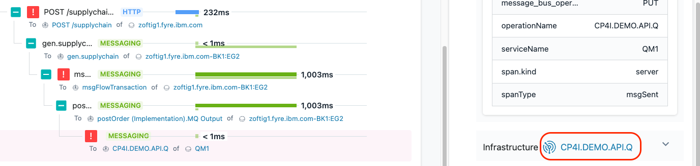

In this section of the lab, you will learn how Instana can help you get to root cause of a problem in a quick and intuitive manner.

## 2-1: Evaluate the Events via an Incident

On the left side, select **"Events"**

You will see a list of Incidents that are affecting the environment.  It will be all Incidents that occurred within the time window you have selected in the upper right corner.  For example, 1 hour.

This will open up a panel showing all of the Incidents that are affecting the monitored systems and applications. 
You will also notice that there is an **Issues** tab and a **Changes** tab.  The **Issues** tab is all of the raw events 
that are effecting the environment.  The **Change** tab is a list of changes that have occurred.
The **Incidents** are the raw Events (Issues) that have been correlated via Analytics into an Incident. 

Make sure that the time selection in the upper right corner is set to **"Last hour"**

As seen in the previous picture, select the Incident that is triggering on the **QOTD High Erroneous Call Rate** on the 
**vader-acemq.coc-ibm.com-BK1:EG2** entity.  You will notice that it is an Incident indicating that the Erroneous 
call rate exceeded 5%. 

You will see the details related to raw **Issues/Events** that were correlated via **analytics** into an **Incident**.

In this case, you should see that 4 Issues/Events were correlated into a single Incident.  In many cases, you'll see 10 or more.
This provides you with noise reduction in the environment and additional context as you debug the problem.

Within the Incident, you can see when each **Event** opened and in some cases, when they closed. 

You will see the **"Triggering Event"** and any **"Related Events"**.  The triggering event is the first event that 
impacts an application.  Either a service or a website.  The related events are a timeline of the related events with the first event at the top.

On the right side, click on the **"+"** symbol to expand the Triggering Event.

You can see in the historical graph that the erroneous calls reached high rates for a period of time.

## 2-2: Analyze the Calls

Next, click the **"Analyze Calls"** button to analyze the calls.

You will be taken to an analytics screen where you can see a summary of the failed calls for **gen.supplychain**.

Click on the down arrow to expand to see the list of failed calls.

You can see a large number of failed calls.

Select one of the failed **gen.supplychain** calls.

You will be taken to a screen where you can see the Call Stack and Stack Trace data. You explored this previously, 
but you did it with a good transaction.  Now you are examining a failed transaction.

Scroll to the bottom of the page where you see the **call stack**.  

Expand the plus signs to see the full **call stack**

You should now see the full **call stack**.

When you see errors, normally you go to the bottom of the call stack.  That's because the error in the last call is likely affecting the upstream calls.  

Click on the last error and examine the information on the right side. 

You will see the following error message:  **IBM MQ call failed with compcode '2' ('MQCC_FAILED') reason '2053' ('MQRC_Q_FULL')**

This error message indicates that the MQ Queue is full and new messages can't be put on the queue.  In the future, Instana will be providing a translated error message for 
key messages like this so that you don't have to lookup the error codes.

At this point, we believe we have a diagnosis for our problem.  The MQ Queue is full and the transactions are failing because they can't post a message to the queue.

## 2-3: Confirm Your Diagnosis

In many cases, you can confirm the root cause of the problem by analyzing the **call stack** and **stack trace**, but sometimes you need to investigate further.  

In this case, you may want to examine the queue that is causing this error.  Instana automatically puts a link to the queue in the lower right corner.  For other technologies, 
there are similar links.

Now, scroll all the way to the bottom on the right side of the screen.  You'll see that there is a link that will link to the MQ Queue named CP4I.DEMO.API.Q.  This is the queue that
is being used for this application transaction.

Click on the link to navigate to the queue details.

On this screen, you'll notice a few important things.
- In the upper right corner, you'll notice that the time range is specifically set to the timeframe when the Incident was open.
- Notice that during a portion of the time, the queue depth reached 100%.  In this case, the **Max** depth is the same as the **Current** depth.
- No messages are going in or out of the queue.

Clearly there is a problem with this queue.  The queue is full and transactions won't work properly because new messages can't be placed on the queue.  We need to resolve the queue depth problem in order to fix the application.

That completes this section of the lab.

## 2-4: Summary
In this portion of the lab, you learned out to diagnose a problem in Instana.  Ultimately, determining that the queue was 
full and preventing transactions from completing.

***